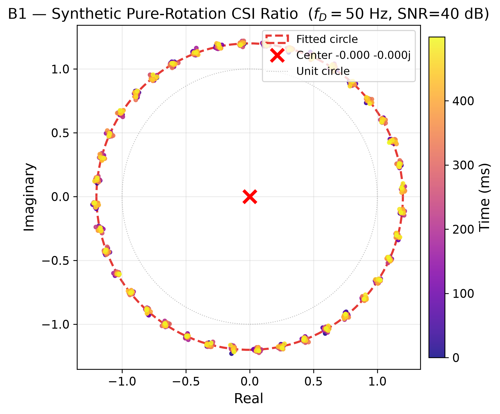
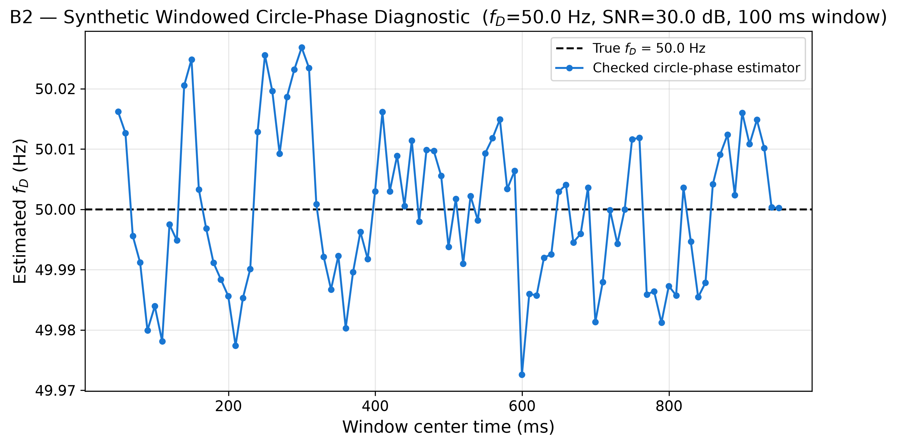
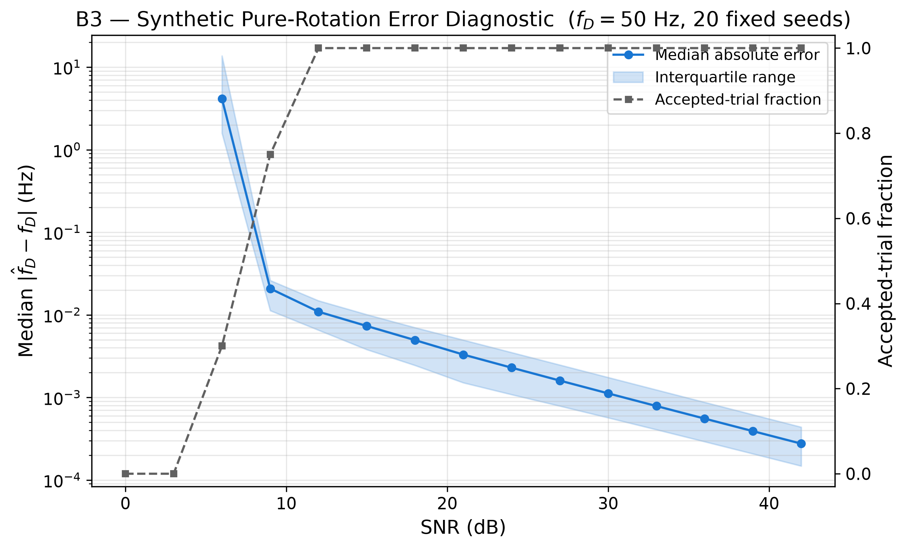
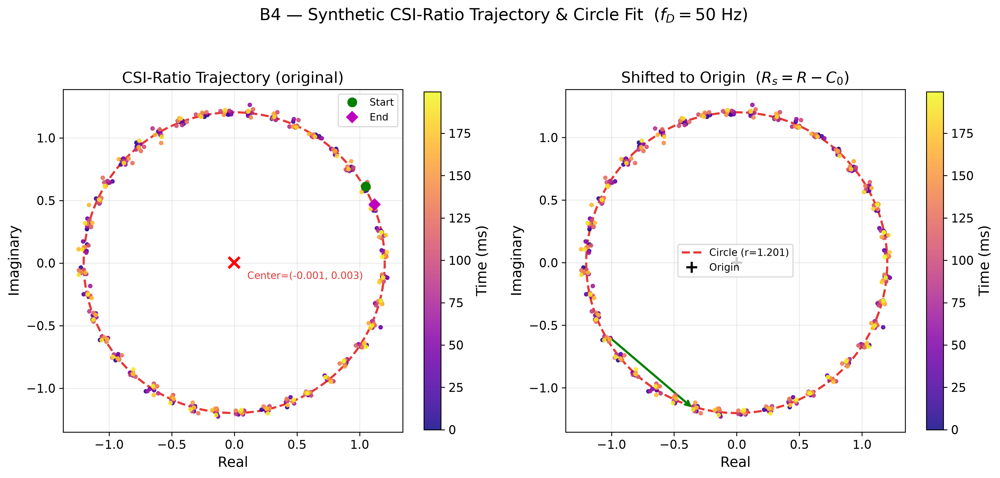

# CSI-Ratio Doppler Frequency Estimation

> Educational, synthetic-data implementation of one checked circle-phase rotation estimator.
>
> 📄 **Reference**: Xinyu Li, J. Andrew Zhang, Kai Wu, Yuanhao Cui, and Xiaojun Jing, [“CSI-Ratio-Based Doppler Frequency Estimation in Integrated Sensing and Communications”](https://doi.org/10.1109/JSEN.2022.3208272), *IEEE Sensors Journal*, vol. 22, no. 21, pp. 20886–20895, 2022.
>
> **Evidence level**: educational surrogate. The checked-in figures use generated data. This baseline does not claim paper-figure, hardware-data, or exact algorithm parity.

[](https://www.python.org/)
[Tests](./tests/)
[](../../../LICENSE)

## Scope and model

If two antenna channels contain the same multiplicative receiver offset,

$$H_m(t) = \left(s_m+d_m z(t)\right)e^{j2\pi f_o t},\qquad
z(t)=e^{j2\pi f_Dt},$$

their noiseless ratio cancels that common factor:

$$R_{mr}(t)=\frac{H_m(t)}{H_r(t)}
=\frac{s_m+d_mz(t)}{s_r+d_rz(t)}.$$

This is generally a Möbius trajectory, not a pure phase exponential. Cancellation applies only to a truly common multiplicative impairment; independent noise and antenna-dependent errors remain. The denominator must also stay away from zero.

The repository includes an algebraic circle fit followed by a weighted phase-slope fit. Earlier local cycle-crossing and lag-difference adapters were removed because they did not have enough evidence to distinguish incomplete/aperiodic arcs, and raw ratio phase does not complete a cycle when a Möbius circle fails to enclose the origin. The circle’s traversal speed is generally non-uniform. Stationary or degenerate trajectories are rejected rather than assigned a fabricated estimate.

The estimator normalizes the ratio before the algebraic fit, making the checked
result invariant to nonzero complex scales from `1e-100` through `1e100`.  It
also enforces two validity conditions before returning a frequency: at least
π radians of unwrapped fitted-circle coverage and weighted phase-linearity
`R² >= 0.95`.  A general Möbius trajectory that traverses its circle too
non-uniformly is rejected even when its physical Doppler is below Nyquist.
Inputs whose numerator/reference quotient is not representable in finite
binary64 are rejected explicitly. Magnitude screening and quotient evaluation
use component-scaled arithmetic, so finite real and imaginary inputs up to the
binary64 maximum are not rejected merely because an intermediate complex
magnitude or square would overflow.

The estimators report observed rotation frequency. Rotation sign alone does **not** identify approaching versus receding motion without a declared complex-exponential convention, geometry, and static/dynamic path-dominance condition. Therefore `direction` is returned as `"unknown"` and `rotation_sign` describes only the observed complex-plane rotation.

Sampling also makes frequency ambiguous modulo the sampling rate. The result includes `alias_limit_hz = 1/(2*T_s)` and `alias_ambiguous = True`; callers must establish a below-Nyquist prior before interpreting the principal observed rotation as physical Doppler.

## Checked synthetic examples

These plots are generated from the exact pure-rotation unit-test construction
in `csi_with_doppler`; they illustrate local numerical behavior, not measured
performance, a comparison to the paper, or a ranking guarantee. B2 contains
only the checked circle-phase estimator. B3 reports the accepted-trial
fraction plus the median and interquartile range *conditional on passing the
declared coverage/R² validity gate*, from 20 deterministic seeds
(`100 * trial + 7`) at each SNR. Rejected trials are not silently converted to
large errors or omitted from the denominator. The plot is a synthetic
diagnostic, not an experimental confidence interval.









## Quick start

From the repository root, use the workflow-pinned uv 0.11.28 and the complete
hashed lock:

```bash
uv lock --check
uv sync --locked --only-group ci
.venv/bin/python -W error -m pytest code/baselines/csi_ratio_doppler_estimation/tests -v
.venv/bin/python code/baselines/csi_ratio_doppler_estimation/examples/generate_figures.py
```

### Exact unit-test oracle

```python
import numpy as np

from src.csi_ratio import compute_csi_ratio
from src.mobius_estimator import mobius_doppler_estimate
from src.signal_model import csi_with_doppler

t = np.arange(1000) * 0.0005
H1, H2 = csi_with_doppler(
    t,
    f_D=50.0,
    snr_db=25.0,
    rng=np.random.default_rng(7),
)
ratio = compute_csi_ratio(H1, H2)
result = mobius_doppler_estimate(ratio, T_s=0.0005)
print(result["rotation_frequency_hz"], result["rotation_sign"], result["direction"])
```

`csi_with_doppler` deliberately constructs a pure rotating ratio so tests have a known oracle. Use `csi_static_dynamic_model` for the general static-plus-dynamic Möbius form.

## Implemented objectives

The circle routine minimizes the algebraic residual

$$\min_{A,B,C}\sum_k
\left(x_k^2+y_k^2-2Ax_k-2By_k-C\right)^2,
\qquad r=\sqrt{C+A^2+B^2}.$$

This is not the geometric radial-distance objective and the optional iterative routine is an inverse-radial-distance reweighted algebraic fit, not a Pratt or Taubin fit.

The phase adapter fits

$$\theta_k\approx\beta_0+\beta_1t_k,
\qquad \widehat f_{\mathrm{rot}}=\frac{\beta_1}{2\pi}.$$

The fitted frequency is a windowed rotation proxy. It needs enough angular coverage and a below-Nyquist prior.

## Layout

```text
csi_ratio_doppler_estimation/
├── src/
│   ├── signal_model.py
│   ├── csi_ratio.py
│   ├── circle_fit.py
│   └── mobius_estimator.py
├── tests/
├── examples/generate_figures.py
└── results/
```

## Citation

```bibtex
@article{li2022csi,
  title   = {CSI-Ratio-Based Doppler Frequency Estimation in Integrated Sensing and Communications},
  author  = {Li, Xinyu and Zhang, J. Andrew and Wu, Kai and Cui, Yuanhao and Jing, Xiaojun},
  journal = {IEEE Sensors Journal},
  volume  = {22},
  number  = {21},
  pages   = {20886--20895},
  year    = {2022},
  doi     = {10.1109/JSEN.2022.3208272}
}
```
